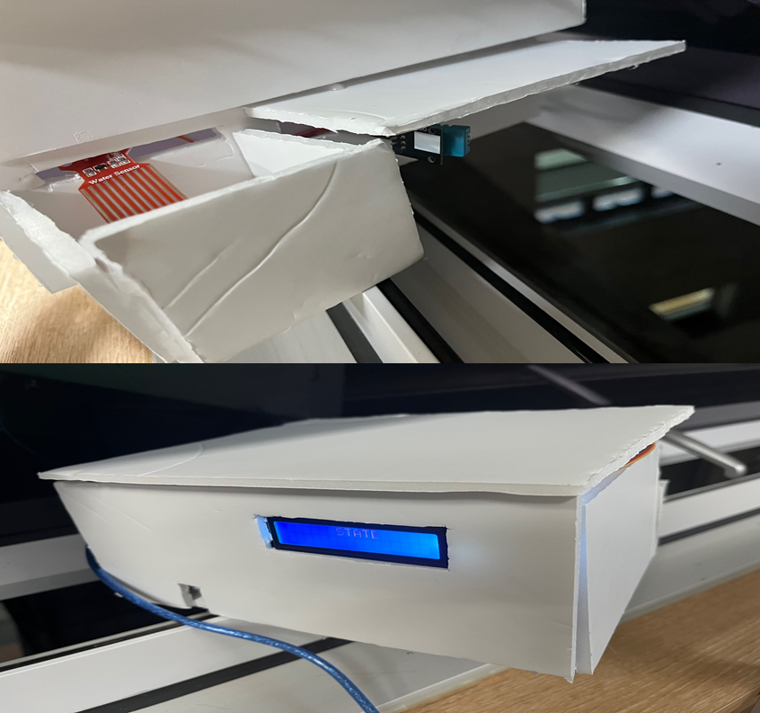

# 🌬️ 스마트 환기 시스템 (Smart Ventilation System)

**실외 환경 센서 기반 자동 제어 + 앱 연동 수동 제어가 가능한 IoT 기반 창문 제어 시스템**

---

## 📌 프로젝트 개요

실외 환경을 기반으로 창문을 자동 개폐하고, 앱을 통해 수동 제어도 가능한 스마트 환기 시스템입니다.  
온습도, 조도, 빗물 센서 값을 바탕으로 날씨 조건을 판단하고, 낮과 밤 시간에 따라 자동 환기를 수행합니다.  
창문 상태와 환기 시간은 실내 LCD에 표시되고, 사용자는 LDPlayer 앱을 통해 수동 제어가 가능합니다.

---

## 👤 담당 역할

- Arduino에서 Bluetooth로 수신한 환기 명령을 기반으로 창문 개폐 로직을 구현하고, LCD에 창문 상태 및 잔여 시간을 시각화
- STM32를 활용한 조도, 온습도, 물 센서 기반 자동 환기 조건 판단 및 모터 제어
- Android 앱과 연동된 수동 개폐 기능 구현  
- 팀원과 협업하여 하드웨어 회로 및 시스템 구조 설계

---

## 💡 주요 기능 요약

| 기능 | 설명 |
|------|------|
| 자동 환기 | 낮 20분 / 밤 10분 자동 개방 |
| 날씨 반응 | 비/눈 감지 시 창문 자동 차단 |
| 수동 제어 | 앱을 통한 수동 환기 가능 |
| 상태 표시 | 실내 LCD로 실시간 창문 상태 출력 |

---

## 🖼 시스템 외관

실외 센서로 날씨 상태를 감지하고, 실내 LCD에 환기 상태를 시각적으로 표시하는 구조

**구성 요소 및 역할**

- **실외 설치 센서**: 낮/밤 확인 여부를 위한 조도, 온습도, 물 감지 센서로 강수 상황 등 실시간 감지
- **실내 LCD 출력**: 창문 상태와 남은 환기 시간을 실시간으로 표시

---

## 🎬 시연 영상

> 대표 영상: 시스템의 전체 외관과 동작을 정면에서 시연한 영상입니다.

**기능별 영상 목록**
- [자동 환기 (밤 ver)](https://www.youtube.com/watch?v=wj5dwBAiQyQ)
- [자동 환기 (낮 ver)](https://www.youtube.com/watch?v=7BeJ7oZOGAQ)
- [수동 제어](https://www.youtube.com/watch?v=WrUHRRQA55w)
- [시연 (뒷모습)](https://www.youtube.com/watch?v=XbNx82TxVpQ)

---

## 🛠️ 사용 기술 및 환경

**프로그래밍 언어**  

**하드웨어**  

**센서 & 장치**  

- 온습도 센서 (DHT 계열, 실외 설치)  
- 조도 센서  
- 물 감지 센서 (빗물/눈 감지)  
- 창문 제어용 모터 및 구동 회로  
- 16x2 LCD 디스플레이 (실내 설치)

**통신 및 제어 방식**  
- Wi-Fi / Bluetooth  
- 모터 제어를 위한 GPIO 신호 및 센서 입력 기반 제어 로직

**앱 환경**  
- LDPlayer 4.0 (Android 에뮬레이터)  
- 앱 버튼으로 수동 환기 제어

---
